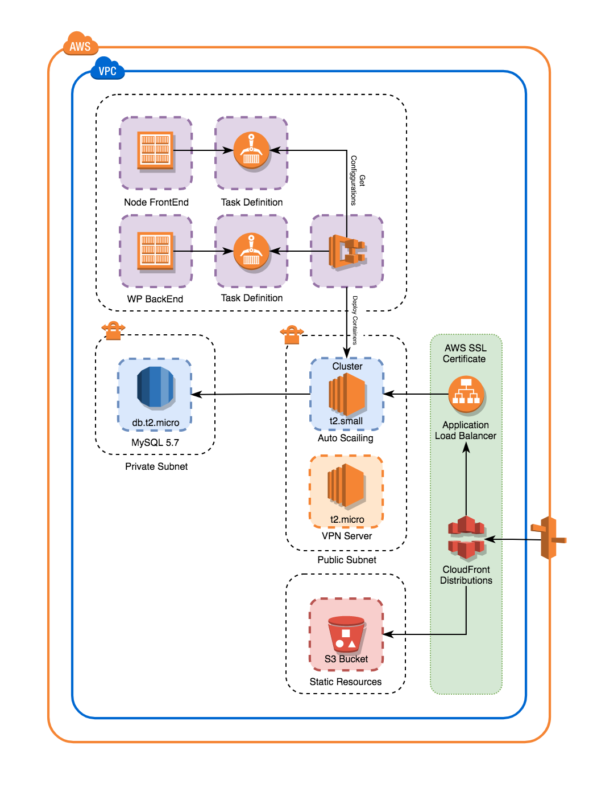

# Terraform AWS - ECS with Auto Scaling Group
 

This Terraform project was developed for the creation of an ECS cluster with High Availability, it includes an S3 section with CloudFront.

#### Diagram


## Environments
Inside of this directory, you could find the Profiles in which you can specify how they must be configured, is highly recommend have the `templates` folder in which you could save Keys, Scripts or other files that you could need. Also, you have to create the file `terraform.tfvars` that will contain all the values to be used in the environment, these values are really highly sensitives for this reason never had been inside of repositories, always must to be added in the `.gitignore` file.

The `main.tf` file is the profile that indicates what, how and how many resources will be created. Iside of the `variables.tf` you could see which variables do you need, some of them have default values these could be optional, all other variables that not include default values are required.

## Modules
Based on the official Amazon repositories these modules was reworked in order to make them more flexibles and easy to understand. There is one module specific for each important section or element in the infrastructure and could be re-utilized multiple times.

## Execution
In order to execute the Terraform script you have to move into the Environment directory and then type the next commands in the Terminal.

The command `init` load the source of the modules from the directory or the repositories.
> NOTE: This command also could be used to check the syntaxis.

```bash
terraform init
```
Throuth the `plan` command you can check what changes will be applied before to apply the changes.
```bash
terraform plan
```
Finally you have to type the command `apply` to execute the changes on the AWS environment, before to apply the changes it will request for approval and show you a similar output that the `plan` command.
```bash
terraform apply
```
#### Terraform Backend
In order to colaborate with others people you have to define a backend file inside of the environment directory. Using the file `backend.tf` with the next content.

```terraform
terraform {
  required_version = ">= 0.10.3"

  backend "s3" {
    encrypt = true
    bucket = "bucket-name"
    dynamodb_table = "terraform-state-lock-dynamo"
    key = "PROJECT/terraform-develop.tfstate"
    region = "us-west-2"
  }
}
```
Use this file will allow work in team trough the creation of the shared `.tfstate` file that save the current state of the infrastructure and the `DynamoDB Table` avoid that the people execute changes in the infrastructure at the same time causing corruption in the environment.

## Requirements

   - AWS SSL Certificate (optional)
   - AWS Access Key
   - AWS Secret Key

## Resources
   - Application Load Balancer (ALB)
   - Target Groups (TG)
   - Security Groups (SG)
   - Elastic Compute Cloud (EC2)
   - Auto Scaling Groups (ASG)
   - Launch Configuration (LC)
   - Elastic Container Service (ECS)
   - Elastic Container Registry (ECR)
   - Regional Database (RDS)
   - Simple Storage Service (S3)
   - Virtual Private Cloud (VPC)
   - Virtual Private Network (VPN)
   - Subnets
   - Internet Gateway
   - NAT Gateway
   - Routing Tables
